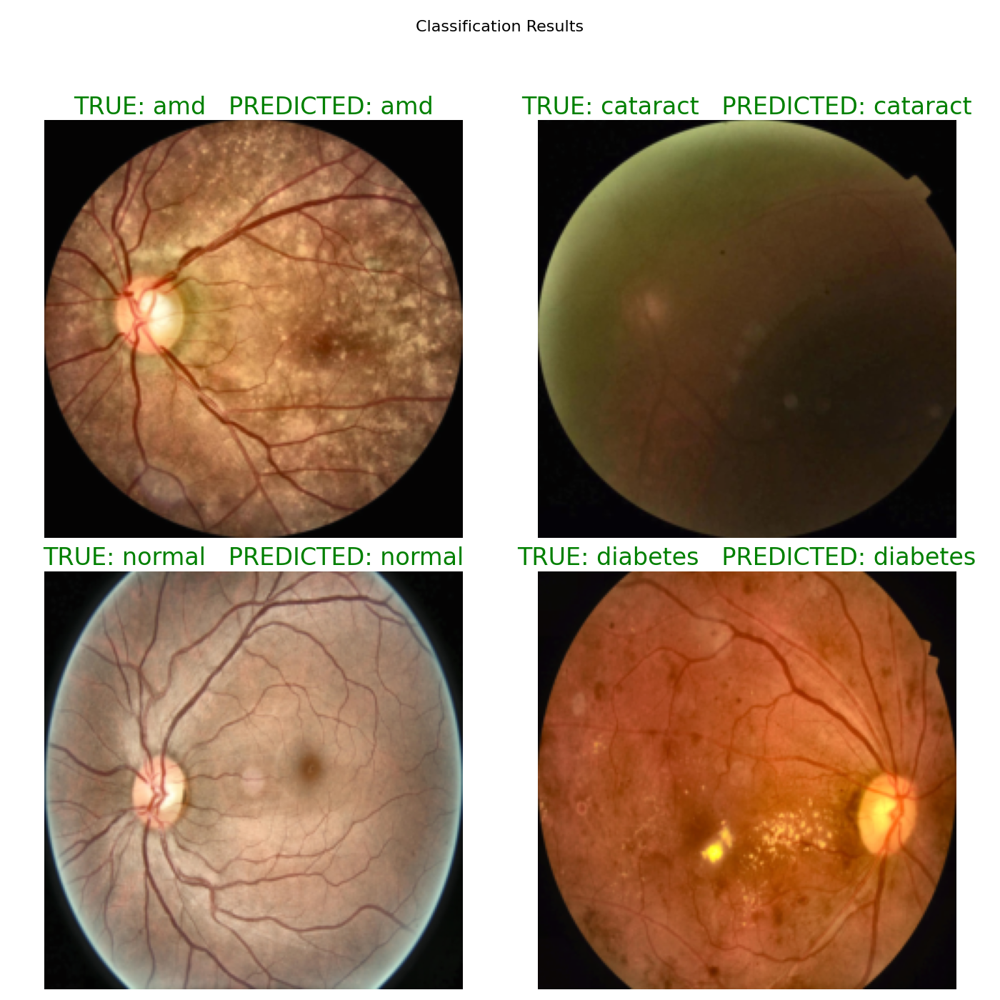

# A Vision Transformer Architecture Built from Scratch in PyTorch for Ocular Disease Classification from Fundus Images

## Dataset

https://www.kaggle.com/datasets/orvile/macular-degeneration-disease-dataset

## Classes

| Split | Class    | Number of Images |
| ----: | -------- | ---------------: |
| Train | AMD      |              394 |
| Train | Cataract |              400 |
| Train | Diabetes |              400 |
| Train | Normal   |              400 |
| Valid | AMD      |               84 |
| Valid | Cataract |               84 |
| Valid | Diabetes |               84 |
| Valid | Normal   |               84 |
|  Test | AMD      |               16 |
|  Test | Cataract |               16 |
|  Test | Diabetes |               16 |
|  Test | Normal   |               16 |

## Results

#### 

## Summary

* Designed and implemented a Vision Transformer (ViT) in PyTorch for multi-class classification of ocular diseases (AMD, Cataract, Diabetes, Normal) using retinal fundus images.
* Built a custom data pipeline including dataset loading, preprocessing, normalization, and train/validation/test sampling.
* Trained the model using GPU acceleration (CUDA) for efficient training and faster convergence.
* Developed visualization utilities to analyze predictions by plotting test samples with true vs. predicted labels for qualitative evaluation.

##